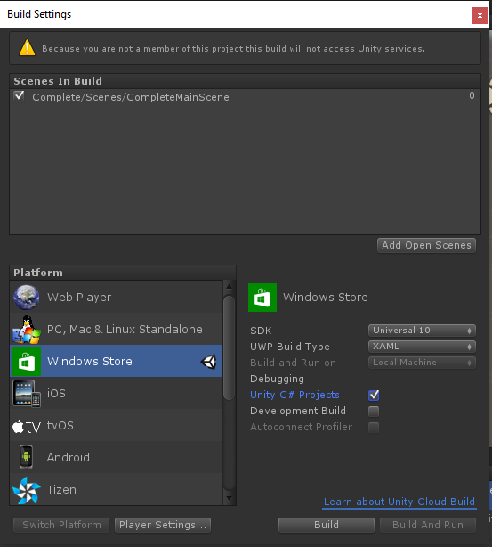
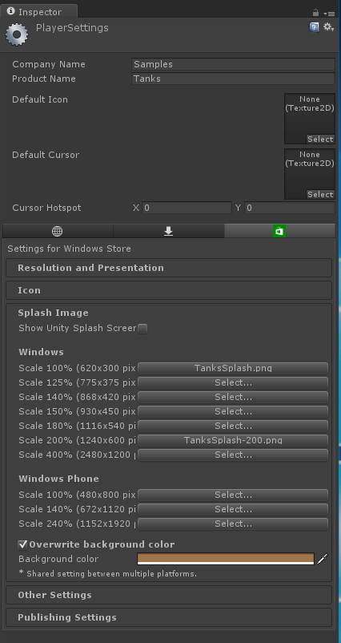
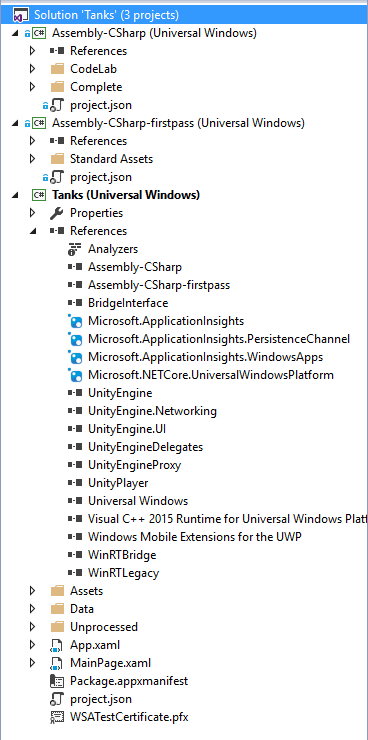
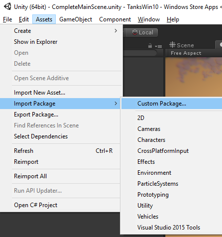
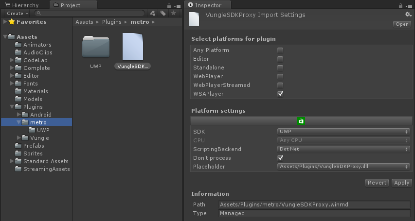

<a name="HOLTop" ></a>
# Integrating Unity Games With Windows 10#


<a name="Overview"></a>
## Overview ##
A great game should include both great game play and native platform integration that engages and aids the user to get the most out of the game. This lab will give you an overview of different techniques you can use to integrate with the Universal Windows Platform from within your Unity game; we will discuss some of the pros & cons of each approach so you can reuse these techniques across any  integration scenario you may encounter.    

<a name="Objectives" ></a>
### Objectives ###

In this module, you will learn about these concepts:

- Understand the different #define pre-processor directives for writing native code on a Windows game.
- Understand how to dispatch calls between Unity's app thread and Windows' UI thread.
- Integrate with Windows 10 by writing inline code to your Unity game.
- Integrate with Windows 10 by consuming and configuring Unity plugins.

> **Note:** This module is optimized to show you integration techniques. Most of the Unity code (game play, menus, event handlers) has been coded for you; you will need to inject the native code at right places, but the module does not explain the 'glue' code we wrote in Unity. You will be able to walk through that on your own (as you have all the source). If you want to learn how to write the game, you can find very detailed  video tutorials for building the game at [Unity's learning site](https://unity3d.com/learn/tutorials/projects/tanks-tutorial).

<a name="Prerequisites"></a>
### Prerequisites ###
The following software is required to complete this module:

- [Visual Studio Community 2015](https://www.visualstudio.com/products/visual-studio-community-vs) or greater. 
- [Unity 5.3.3f1](http://unity3d.com/get-unity/update) or later.
- The 'starter' solution for this module. You can get it from [Microsoft-Build-2016/CodeLabs-GameDev-2-UnityWin10](https://github.com/Microsoft-Build-2016/CodeLabs-GameDev-2-UnityWin10.git) github repository. The repo only shows Ex1 (as in Exercise 1) but that works for all exercises in this module. 

The following software packages are used within the module. These can be optional, as you can choose to skip the exercises, but covering all exercises is recommended for the most comprehensive learning; to do all exercuses, you should install these extra  pre-requisites.

- Vungle's Unity plugin. For _//build_ event, we have included this in the 'extra files' in the repo.  Post _//build_ event, you should get it from [Vungle's github repo](https://github.com/Vungle/Unity-Plugin)
- [Microsoft Universal Ads SDK](https://visualstudiogallery.msdn.microsoft.com/401703a0-263e-4949-8f0f-738305d6ef4b )


<a name="Exercises"></a>
## Exercises ##
This module includes the following exercises:

1. [Exporting Unity Project to Windows Store with C# Projects] (#Exercise1)
1. [Using Unity's native integration helper libraries] (#Exercise2)
1. [Adding WinRT inline code to a Unity game] (#Exercise3)
1. [Configuring a reference to a Unity plugin] (#Exercise4)
1. [Taking a bridge approach to integration] (#Exercise5)

Estimated time to complete this module: **60 minutes**

<a name="Exercise1"></a>
### Exercise 1: Exporting Unity Project to Windows Store with C# Projects ###

1. Open the **Ex1/Begin** project in Unity.

	> **Note:** If using default setup at the event, the folder is at
**C:\labs\CodeLabs-GameDev-2-UnityWin10\Source\Ex1\Begin**.


1. In Unity, let's prepare our project so we can build a player targeting UWP. You can do this via **File-> Build Settings** menu.  Don't click **Build** yet, we need to configure a few options.

1. In the **Build Settings** dialog box, select **Universal 10** as target SDK.

1. Select **XAML** as the **UWP Build Type**. XAML is used for most games  as it allows you to bring XAML UI (like Web Views, and dialogs) into your game. In this case, we need XAML UI for showing ads in a later task.   

1. For this exercise, make sure you select the option to Export **Unity C# projects**; we will explain what this option does when we walk through the output from the build step.

	

	_Build Action_

1. Before we click **Build**, we should also set our Player Settings. Click the **Player Settings** button.

1. In player settings you can configure the name of your app, the splash screen, icons and tiles, orientation, rendering options, sensors, capabilities, and many other options. Explore all of these and feel free to change them.

	

	_Player Settings_

1. The setting that we are after in our case is under **capabilities** in the **Publishing Settings** section. [Capabilities](https://msdn.microsoft.com/en-us/library/windows/apps/br211422.aspx) is a UWP concept, it declares an intent to use a protected resource.  For our project, we need to add the **InternetClient** capability so that later when we show ads these can be downloaded from the internet.

	

	_Player Settings Capabilities_

1. When done configuring player settings,  click **Build**. You will be prompted to select a folder you are building to. Give it any project name. If you want to mimic our solution (not required) you can call it _Win10Solution_.

1. The build process will take a few minutes, when it is completed, Unity will launch a **Windows Explorer** window to your build folder. Locate the **Tanks.sln** in that folder and open it in Visual Studio.

1. Let's now explore the solution and projects that Unity created.

	

	_Exported Projects_

	- **Tanks (Universal Windows)** is our game; this is the project we will submit to the Windows Store.

	- **Tanks (Universal Windows)** references **Assembly-CSharp.dll**, which is the game generated by Unity. This assembly has all our MonoBehaviours and game logic.

	- The data folder in Tanks project is where Unity put the projects' resources, assets, levels, etc. 

	- **Package.appxmanifest** is the manifest (configuration file) for our project. In this file, you will find what we configured under **Player Settings** and **Build Settings** in the Unity Editor. There are more settings here, so do explore it. 

	- The **Assembly-Csharp** and **Assemby-CSharp** first pass projects are  what Unity usually builds in the **Editor**. In this case, Unity generated them because we chose the option to create **Unity C# projects**. These will be handy for today as they allow us to recompile Assembly-CSharp (our game logic) from within Visual Studio without having to rebuild from Unity. Of course that works if all we modify is the code; if we modify scenes or add resources or change player or build settings, then we must rebuild from Unity. If you rebuild from Unity to the same build folder, Unity will not override the code and settings for Tanks (Universal Windows) project. Unity preserves these so that any changes you make to the project are not overwritten.

> **Note**: Since AssemblyCSharp has our game, that is where all files we edit today will be. There are two folders to look after: 
- _Complete_ is the folder that has the original game. It is called Complete as that is the folder at end of Unity's tutorial. Our _GameManager_ is there; we did tweak this file beyond Unity's tutorial. 
- _CodeLab_ has a few scripts we added for the codelab. Our _SocialDialogManager_ and the Microsoft Ads scripts are there. 

#### Let's see it!####
Our game is already functional.

1. To run it, change the target platform in Visual Studio from **ARM** to **x86**.

1. Press **F5** or click on the **Local Machine** button in Visual Studio to start the game. 

Of course, our game right now has no Windows integration; we will add that in our next steps. 
 

<a name="Exercise2"></a>
### Exercise 2: Using Unity's native integration helper libraries ###

For native integration, Unity includes a few wrappers for Windows Store features like tiles, toast notifications, and launchers.  These features are in the **UnityEngine.WSA** namespace.

Let's use the UnityEngine.WSA.Launcher APIs, to launch Help for our game, and to add a "rate us" feature to our game.

1. In **GameManager.cs** (located in Complete\Scripts\Managers folder), there is already an Input handler for F1 key in the Update loop, so we can add the code to launch our help screen in the browser.

	````C#
	void Update ()
	{
		if (Input.GetKeyUp(KeyCode.F1))
		{
			UnityEngine.WSA.Launcher.LaunchUri("https://github.com/Microsoft-Build-2016/CodeLabs-GameDev-2-UnityWin10/blob/master/Images/TanksHelp.jpg",
				false);
		}
		...
	}
	````

1. This same technique can be used to implement the 'Rate us' functionality. There is already a "Rate us" button in the game. For demo purposes, it is coded to come up every 4th time you finish a round. So all we have to do is add code to the **OnRateClicked** event handler in the **SocialDialogManager** Behaviour (this file is located in CodeLab\Scripts\SocialDialogManager folder).

	````C#
	public void OnRateClicked ()
	{
		UnityEngine.WSA.Launcher.LaunchUri("ms-windows-store:REVIEW?PFN=Microsoft.Channel9_8wekyb3d8bbwe",
								false);
		DismissDialog();
	}
	````

1. For our final example of this technique, and to illustrate a little more immersive integration, let's add live tiles to our game.  At the end of each round, we can add a teaser message so users can come back if they quit game in middle of a round. Our **GameManager** already has a **SetLiveTile** method that gets called at end of each round.  This method will update the text on our main live tile, and set an image to scroll with the tilea to make it pop with more interactivity.   

	````C#
	void SetLiveTile ( string textmessage )
	{
		 UnityEngine.WSA.Tile.main.Update( "ms-appx:///Data/StreamingAssets/TanksIcon_150x150.png" ,
				"ms-appx:///Data/StreamingAssets/TanksIcon_310x150.png", string.Empty, textmessage);
	}
	````

#### Let's see it!####
We have added three features to our game. Let's now go see them in action!

1. Viewing the Help file is easy. Any time during the game, press **F1**.
1. To see the **social dialog** that prompt the user to rate the game, just play a few rounds. At the end of a round you will be prompted with a dialog to rate the app.
1. The live tile is getting updated at end of each round; there is no UI to ask user if they want to update tile, etc. so play a round and if you want to see the code, set a break point in **SetLiveTile**.
To see the live tile, you do need to have it pinned to your Start menu. You can pin the tile before, or after you have run the game.  


#### Discussion around Unity WSA APIs ####

These UnityEngine.WSA.* APIs are convenient and easy to use. You did not notice this yet (we will cover it next), but there are threading requirements the API is abstracting and handling for you, we will explore these in our next exercise. 

Unfortunately, the UnityEngine.WSA APIs do not handle all native integration scenarios. No worries though, there are more options, let's explore our next one: writing inline code in your Unity project to access WinRT APIs.    


<a name="Exercise3"></a>
### Exercise 3: Adding WinRT inline code to a Unity game ###

When Unity games target Windows Store (with a .NET backend, not IL2CPP), they are compiled using the .NET compiler and therefore can access WinRT APIs; as part of their build process, Unity links against WinRT libraries.  

To inline WinRT code into your Unity project all you need to do is protect yourself so that Unity does not try to compile that code when targeting other platforms; for this, we will use the NETFX_CORE pre-processor.

Unity's documentation has more guidance on [pre-processors defines for platform specific compilation](http://docs.unity3d.com/Manual/PlatformDependentCompilation.html).  For today' exercises we will use these directives:

- **NETFX_CORE** to filter for code that compiles against .NET Coreand links to WinRT.
- **WINDOWS_UWP** to ensure code is used only on Windows 10, when APIs are Windows 10 specific.
- **UNITY_EDITOR** to filter out code that only runs in the editor.

To exercise inlining code, we want to add support to enter and exit full screen mode when the user presses F11 in our game. The game is already listening for keyboard input in the **Update** loop in **GameManager.cs**, so we can add the code to enter/exit full screen there:

````C# 	
else if (Input.GetKeyUp (KeyCode.F11))
{
#if NETFX_CORE && WINDOWS_UWP
	 //Dispatch from Unity App thread to Windows UI Thread
	 UnityEngine.WSA.Application.InvokeOnUIThread( ()=>
	 {
		  var appView = Windows.UI.ViewManagement.ApplicationView.GetForCurrentView();
		  if (appView.IsFullScreen)
				appView.ExitFullScreenMode();
		  else
				appView.TryEnterFullScreenMode();
	 } , false);
#endif
}
````

Here are the relevant details to notice from our snippet:

- It is inside a `#if NETFX_CORE && WINDOWS_UWP` so other platforms don't call into it and Unity does not try to compile when targeting other platforms.
- It is inside a delegate invoked by **UnityEngine.WSA.Application.InvokeOnUIThread**. Two of the most useful functions in the **UnityEngine.WSA** namespaces are:
	- **Application.InvokeOnUIThread** used to dispatch a call from Unity's app thread to Windows' UI thread
	- **Application.InvokeOnAppThread** used to dispatch calls from any thread to Unity's app thread.

In our case, **ApplicationView.TryEnterFullScreenMode** requires that it be called from the UI thread, that is why we dispatched the call, but not all WinRT calls need to be dispatched. For example, scheduled local toast notifications (which can be used to reengage users) can run from the Unity App thread and doesn't need dispatching.   Our game is already stubbed to schedule a toast notification, it has a **ScheduleReEngagement** method in GameManager.cs, where we can add some notification code: 

````C# 	
void ScheduleReEngageToast()
{
    if (needsSessionToast)
    {
        string invite = "Your ammo is piling up. Let's battle!";
        DateTime dueTime = DateTime.Now.AddSeconds(40);

#if NETFX_CORE  
        var notificationXmlDoc = ToastNotificationManager.GetTemplateContent(ToastTemplateType.ToastText01);
        var textNodeList = notificationXmlDoc.GetElementsByTagName("text");
        if (textNodeList.Count > 0)
        {
            textNodeList[0].AppendChild(notificationXmlDoc.CreateTextNode(invite));
            var toast = new ScheduledToastNotification(notificationXmlDoc, dueTime);
            toast.Id = (++toastId).ToString();
            ToastNotificationManager.CreateToastNotifier().AddToSchedule(toast);
        }
#endif 
        needsSessionToast = false;
    } 
}
````
Notice that in this case, we only need a `NETFX_CORE` pre-processor, since these APIs work in Windows 8.x too. The full screen API we used earlier is Windows 10 only, that is why we had `NETFX_CORE` && `WINDOWS_UWP`.   That said, for the code above to compile you need to add the right using statements near the top of GameManager.cs  

````C# 	
#if NETFX_CORE
using Windows.UI.Notifications;
using Windows.Data.Xml.Dom;   
#endif
````


#### Let's see it!####

To toggle in and out of full screen mode, just run the game and press **F11**. 
If you are curious, comment out the dispatcher call and call TryEnterFullScreenMode without dispatching and see what happens (ahem, crash, ahem).   

To see the toast notification,  just win a battle in the game and wait 40 seconds. You can even exit the game, the notification will fire even when game is not running. This way you could re-engage a user who has not played your game in a few days. 


#### Discussion around inlining code ####

You have now seen how easy it is to inline WinRT code. Just understand and pay attention to your threading models, and you will be fine; it works great for WinRT and .NET APIs. However, what about calling custom libraries (such as an analytics library, or an ads SDK)? Of course, Unity allows that, via plugins. Let's cover that next.

<a name="Exercise4"></a>
### Exercise 4: Configuring a reference to a Unity plugin ###

This section discusses referencing a managed Unity plugin; it focuses on the Windows' specific options to configure it and reference it. For practical purposes here, let's summarize a plugin as a .NET assembly or WinRT component (winmd) that we need to reference from within our Unity code.

If you want to dive deeper into plugins, please see this [reference](http://docs.unity3d.com/Manual/Plugins.html) in Unity's documentation.

1. Go back into **Unity Editor**.

1. Add a reference to Vungle's Unity Package, which includes a managed plugin. To do this, select **Assets -> Import  Package -> Custom Package**.

	

	_Import Custom Package in Unity Editor_

1. Navigate to the folder where your **VungleSDK.UnityPackage** is located. If you are using the one pulled with this repo, it is in the **Source/ExtraFiles/Vungle** folder.

1. Click **Open** to add the package to our Unity project.

1. After selecting the package, you will see the **Unity Import Dialog**.  In Vungle's case, they ship code for all platforms (iOS, Android, Windows). This is fine for us. Click **Import** to import all the files. Let's now review the important ones (for Windows Store and Windows Phone) configurations; the files are in the Plugins folder. 

	 - Notice the files are under a **Plugins/Metro** folder structure. Unity follows a specific folder hierarchy and naming convention, with a folder name for each different target platform. Starting with Unity 5, the folder hierarchy is not required, as Unity allows you to configure it manually via the new Plugin inspector, but for ease of use, it is still handy to follow. You can find out more about these folder names in Unity's [Plugin Inspector documentation](http://docs.unity3d.com/Manual/PluginInspector.html).

	 - There is a **UWP** folder. This is used for plugins for Universal (Windows 10) Projects.

	 - There is a **WindowsPhone81** folder, since Vungle supports Windows Phone 8.1 too. We are not going to need that today, so <u>delete that Windows Phone 81 folder and its contents</u>.

1. Let's now configure the rest of our SDK references, pay close attention as there is a lot details here. Go to the **Plugins** Folder and notice the **VungleSDKProxy.dll.** This DLL since is at the root of the plugins folder right now is applicable to all platforms. Click the dll to see it's import settings, ensure the plugin's selected platform is **Editor** (for this, uncheck the *Any Platform* box and check *Editor*). This will be used only when running in the Editor. Click **Apply** after you make your changes. 

	

	_VungleSDKProxy Import Settings_

1. Next, we can go into the **Plugins\Metro** folder and configure the **VungleSDKProxy.winmd**.
	- This winmd needs to target **WSAPlayer** (the platform for Windows Store).

	- Since we are only targeting UWP, select **UWP** under _SDK_.

	- The _Scripting Backend_ should be **Dotnet**

	- Check the **Don't process** checkbox.  Don't process is used to tell Unity that it should not patch the assembly. Unity needs to do extra processing to patch assemblies that have classes that need to be serialized in Unity; for most managed plugins that just add native integration, the Don't process should be checked as these assemblies rarely contain Unity serializable objects. To be precise, the setting is not required since we have a .winmd and Unity knows not to process these, but i wanted to explain the setting, so leave it checked. It this was a dll, then the setting would be needed. 

	- For placeholder, point it to the VungleSDKProxy dll in the **Plugins** folder. This tells Unity to use that placeholder assembly within the Unity editor. We need placeholder assemblies because the Unity Editor is running Mono, it can't load .NET 4.5 assemblies (or WinMDs). Placeholders mimic the API signatures of the assembly we want to use, but placeholders are compiled against .NET 3.5. that way every thing compiles within the editor (susing placeholder), and it also compiles when building to target UWP (using real plugin). 
	- Here is our complete settings for our VungleSDKProxy in Plugins\Metro, so you can verify you made all the changes. Again, click *Apply* when you are done. 

	

	_VungleSDKProxy.winmd Import Settings_

1. Next, delete the **VungleSDK.winmd** file in the **Plugins\Metro** folder. The Vungle package includes this extra file to workaround an issue in earlier versions of Unity, but for 5.3.3 and later we don't need it. Do pay attention to the folder and make sure you only delete the one in Plugins\Metro, not the one in Plugins\Metro\UWP. 

2. Next, we can configure **VungleSDK.winmd** in **Plugins\Metro\UWP** using these settings. 

	

	_VungleSDK for UWP Import Settings_

	> **Note 1:** If you are wondering why VungleSDK does not have a placeholder, it does not need it. All possible calls to this assembly are 'brokered' through VungleSDKProxy, so we don't need a placeholder dll for this.  

	> **Note 2:** That is it, we have now configured all our plugin references. If you want more details around these plugin import settings, Unity's documentation has a good overview of the [import settings](http://docs.unity3d.com/Manual/windowsstore-plugins.html).

1. By adding the Vungle plugin to our Unity project we have changed what Unity needs to compile, so before we go further, we should **Build** within Unity like we did on our first task. Most of the time, when rebuilding, we  let Unity target the same folder we used earlier. What Unity would do here is update our C# projects (**Assembly-CSharp** and **Assembly-CSharp-firstpass**) and rebuild the game with all scripts and the new assets. It will however **not** update our UWP project, because once Unity outputs it once, it does not override the .csproj, the XAML and C# files, etc. Of course this is a problem, as we need for our project to have the new references (_to VungleSDK.winmd_). To get around this hiccup, we can do one of two options:

	- Since we had not made any changes to the project exported by Unity, we can just build to a different folder, and have it create a new project for us to use.

	- We can edit the _unityoverwrite.txt_ file in our previously exported folder (Win10Solution if you used default name) and delete the line that has Tanks.csproj. The line looks like the one below (though your hash will be different). Again you should delete it and save your _unityoverwrite.txt_ file.  By us deleting this line, Unity will know to override it next time we Build. 

		````
		Tanks\Tanks.csproj: 49CB64084B043D447B36B13D5F2CF44D
		````

1. Now we can **Build** and Unity will overwrite the .csproj and include our new references. Of course, in the real-world if you had modified Tanks.csproj by adding more files or changing other settings you would have to merge it. The file is xml, so it is easy to compare and merge.

1. After Unity builds, confirm the new _Tanks.csproj_ has a reference to **VungleSDK** and **VungleSDKProxy**; if that looks right, rebuild all just to ensure it is all working correctly.

1. Now that we have our references configured within Unity and have recompiled, we can call the code to show the ads. Let's go back to Visual Studio.

1. To save you a little typing time (and since the logic is simple and not critical to Windows integration, the code is written, but excluded via a `#if SHOW_VUNGLE_ADS` pre-processor. Go to the top of the **GameManager.cs** file, and uncomment out the `#define SHOW_VUNGLE_ADS` line and let's now review how Vungle is getting called. 

1. In the **Start** function,  we initialize Vungle and subscribe to adCompleted event.

	````C#
	Vungle.init("com.prime31.Vungle", "vungleTest", "vungleTest");
	Vungle.onAdFinishedEvent += OnAdFinished;  
	````

1. Then, within **OnAdFinished** event handler, we call **OnAdCompleted()**.

1. Within **OnAdCompleted** we will reset the volume (since game background music gets muted prior to playing the ads). This **OnAdCompleted** event is worth looking at because it demonstrates using **UnityEngine.WSA.Application.InvokeOnAppThread()** to unmute the background music.

	````C#
	void OnAdCompleted()
	{
		 m_isDisplayingAd = false;
		 if (!UnityEngine.WSA.Application.RunningOnAppThread())
		 {
			  UnityEngine.WSA.Application.InvokeOnAppThread(() =>
			  {
					ToggleMute(false);
			  }, false);
		 }
		 else
			  ToggleMute(false);
	}
	````

1. In GameManager's **RoundEnding** function we call the **ShowAd** method, which first mutes the background music, then calls **Vungle.showAd** and sets a flag so the game loop knows to wait for ad to complete (**m_isDisplayingAd**).

With that, we are now ready to test ads in our game.

#### Let's see it!####
To see Vungle ads, just run the game and win two rounds. After the second round, the ad will show up.  

#### Discussion around plugin configuration ####

You have now seen how to integrate a managed Unity plugin or a WinRT component into your Unity project. Plugins are a critical part of code  reuse and a frequent source of integration  for games, as most games leverage shared analytics, ads, social networks, etc. All of these are powered by reusable plugins.

<a name="Exercise5"></a>
### Exercise 5: Taking a bridge approach to integration ####

In the previous example, we consumed a plugin from within Unity by importing the binary (_VungleSDK.winmd_) into Unity and linking to it. Sometimes, we don't want to do this due to relationships or dependencies between the host app (in this case our Tanks UWP project) and the code we want to run in Unity; or maybe, including the binaries in Unity would be too cumbersome -often this happens if you have an SDK that ships as a nuget package and has a lot of platform dependencies, you end up needing ARM/x86/x64 dlls in Unity). For those situations, we use a standard software development [bridge pattern](https://en.wikipedia.org/wiki/Bridge_pattern) where we can put an abstract defintion of what we want to do (most often an interface) on the Unity side and then leave the implementation to the target host project. Let's illustrate that by replacing our Vungle ads with Microsoft ads on our project.

The code has already been typed for you, it is just hidden under `#if SHOW_MS_ADS` pre-processors, so to run this scenario, comment out the `#define SHOW_VUNGLE_ADS` at the top of game manager and uncomment out the `#define SHOW_MS_ADS`.

````C#
// #define SHOW_VUNGLE_ADS  
#define SHOW_MS_ADS
````

Let's now review the implementation details on the Unity side.  

1. We first need an abstraction to the APIs we want to call. In this case, there is an interface typed for us in **CodeLab\MSAdsBridge\IMicrosoftAdsBridge.cs**.

	````C#
	public interface IInterstittialAd : IDisposable
	{
		 void AddCallback(AdCallback type, Action<object> cb);
		 void ClearCallback(AdCallback type);

		 void RequestAndShow(string appId, string adUnitId);

		 void Request(string appId, string adUnitId, AdType type);

		 void Show();
		 InterstitialAdState State { get; }
	}
	````

1. Next, we need a way to connect our abstraction to our concrete implementation, in this case a factory class.

	````C#
	public class MicrosoftAdsBridge
	{
		 public static IInterstitialAdFactory InterstitialAdFactory { get; set; }
	}

	public interface IInterstitialAdFactory
	{
		 IInterstittialAd CreateAd();

		 IInterstittialAd CreateAd( Action<object> readyCallback,
									Action<object> completedCallback,
									Action<object> cancelledCallback,
									Action<object> errorCallback );
	}
	````

1. Within Unity, we just check to see if we have a valid Factory when we want to instantiate our ads. We do this in **GameManager**'s **Start** method like we did for Vungle ads. The most important code here is the check to see if we have a factory.

	````C#
	if (Microsoft.UnityPlugins.MicrosoftAdsBridge.InterstitialAdFactory != null)
	{
		 m_showAds = true;
		 m_MicrosoftAd = Microsoft.UnityPlugins.MicrosoftAdsBridge.InterstitialAdFactory.CreateAd();
		 m_MicrosoftAd.AddCallback(Microsoft.UnityPlugins.AdCallback.Completed, OnMSAdCompleted);
		 m_MicrosoftAd.AddCallback(Microsoft.UnityPlugins.AdCallback.Cancelled, OnMSAdCancelled);
		 m_MicrosoftAd.AddCallback(Microsoft.UnityPlugins.AdCallback.Error, OnMSAdError);
		 m_MicrosoftAd.Request(MicrosoftAdsAppId, NextMicrosoftAd, Microsoft.UnityPlugins.AdType.Video);
	}
	````

	Once ad is initialized, we can play the video on the same ShowAd method as before.

	````C#
	if (m_MicrosoftAd != null)
	{
		 if (m_MicrosoftAd.State == Microsoft.UnityPlugins.InterstitialAdState.Ready)
			  m_MicrosoftAd.Show();
		 else
			  m_MicrosoftAd.RequestAndShow(MicrosoftAdsAppId, NextMicrosoftAd);
	}
	````

1. As you can see, with the above we have code to instantiate ads and play ads in Unity, yet we have not added a reference to the Microsoft Ads SDK. Unity is completely abstracted/isolated from the SDK. We now need to add the implementation on the UWP project. In Visual Studio, in our Tanks project, add a reference to the Microsoft Universal Ads SDK.

	

	_Add Ads SDK Reference in Visual Studio_

1. Next, we need to add the implementation of our IInterstitialAd interface. Right click on the Tanks project in Solution Explorer, Select **Add**->**Existing Item** and navigate to the ExtraFiles folder in this repo and select the **MSAdsBridge\MicrosoftAdsBridge.cs** file.
>If you are using a //build PC, the ExtraFiles folder is at  C:\labs\CodeLabs-GameDev-2-UnityWin10\Source\ExtraFiles. 

1. Finally, add the class factory so that the Unity code knows how to instantiate ads. This can be done anywhere, but for this kind of implementation, I always prefer to do it in the **App.xaml.cs**  **InitializeUnity**; that feels like a good place to ensure we don't run into a race condition later.

	````C#
	...
	// right after appCallbacks.SetAppArguments(args); add our code..

	Microsoft.UnityPlugins.MicrosoftAdsBridge.InterstitialAdFactory
		 = new Microsoft.UnityPlugins.MicrosoftAdsFactory();
	````

#### Let's see it!####
To see Microsoft ads in action, just run the game and win two rounds. After the second round, the ad will show up.  

#### Discussion around bridge technique ####

The bridge pattern can be handy to avoid lots of platform specific dependencies (if you have a winmd that depends on native libraries that will be different for ARM/x86/x64) it can be easier to do it on the UWP side than on Windows.  It is also easier to manage nuget references that auto-update themselves and can be restored automatically.  This example mostly should give you context on the many options you have to integrate Unity games with native WinRT functionality; referencing .NET assemblies, nuget packages, etc. It all works, since we are just using Visual Studio to manage app and nuget references.  

<a name="Summary" />
## Summary ##

Congratulations!!  You have now successfully completed our lab and should be deeply familiar with how to add native functionality to your Unity game.

There is one topic we did not cover in this lab write-up (due to lack of time).
Unity's [Windows Store plugins documentation](http://unity3dforge.com/documentation/Manual/windowsstore-plugins.html) summarizes succinctly what you need to do, and if you want real-world examples with source code included, you can find plenty at [https://github.com/microsoft/unityplugins](https://github.com/microsoft/unityplugins) repo.
